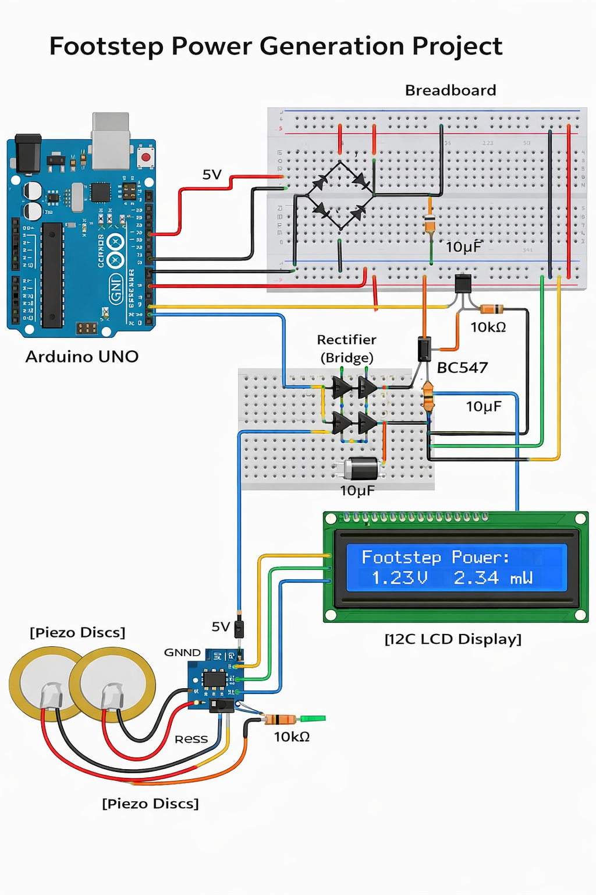
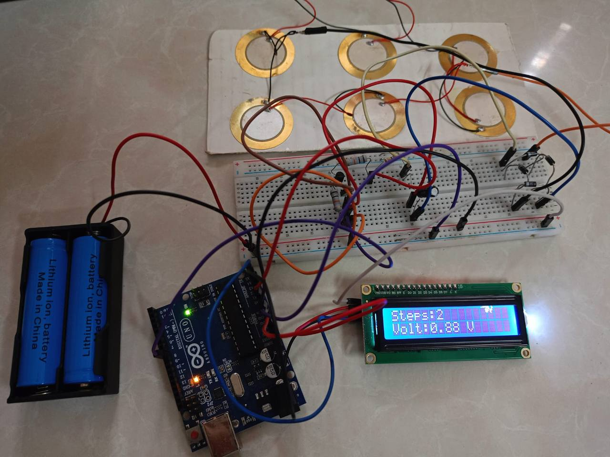

# Project Overview: Footstep Power Generation and Monitoring System using Arduino

## Problem Statement

In modern urban environments such as sidewalks, corridors, shopping malls, railway stations, and public walkways, a significant amount of human kinetic energy generated from footsteps is continuously wasted. Every step taken by pedestrians produces mechanical pressure and vibration energy that typically dissipates into the ground without being utilized.

At the same time, there is a growing global demand for sustainable and renewable energy sources to reduce dependence on conventional energy systems and minimize environmental impact. While large-scale renewable technologies like solar and wind are widely adopted, there is still a lack of efficient solutions for micro-scale energy harvesting in daily human activities.

One of the key challenges is to design a system that can:

Efficiently capture small amounts of mechanical energy from footsteps
Convert irregular and low-amplitude signals into usable electrical energy
Provide real-time monitoring of the generated output
Maintain a low-cost, compact, and easy-to-implement design suitable for educational and practical applications

Additionally, traditional energy harvesting systems often involve complex components and high costs, making them less accessible for student projects and small-scale implementations.

Therefore, there is a clear need for a simple, cost-effective, and efficient footstep-based energy harvesting and monitoring system that can demonstrate the potential of converting human motion into usable electrical energy while also providing measurable and visual feedback.

---

##  Proposed Solution

This project uses **piezoelectric sensors** to convert footstep pressure into electrical energy.

- Multiple piezo discs generate voltage when stepped on  
- A **bridge rectifier** converts AC signals into DC  
- Capacitors smooth the signal  
- Arduino processes the signal and counts steps  
- LCD displays real-time **step count and voltage**

This creates a **low-cost, real-time monitoring system** for footstep energy.

---

##  Features

- Real-time step detection using piezo sensor  
- Threshold-based signal processing  
- Noise reduction using hysteresis  
- Live step count display on I2C LCD  
- Serial monitor output for calibration and debugging  

---

##  Key Components

- **Arduino Uno** – Main controller  
- **Piezoelectric Discs** – Generate voltage from footsteps  
- **Bridge Rectifier (Diodes)** – AC to DC conversion  
- **Capacitors (10µF)** – Signal smoothing  
- **BC547 Transistor** – Signal control/amplification  
- **Resistors (10kΩ)** – Current control  
- **16x2 I2C LCD** – Display output  
- **Breadboard & Jumper Wires** – Connections  
- **Power Supply (Battery/5V)** – System power  

##  Working Principle

- Footstep applies pressure on piezo discs  
- Piezo generates AC voltage  
- Rectifier converts AC → DC  
- Capacitor smooths signal  
- Arduino reads analog voltage  
- If voltage crosses threshold → step counted  
- LCD displays step count and voltage

##  System Operation

1. Footstep → vibration on piezo  
2. Piezo generates voltage  
3. Rectifier converts signal  
4. Arduino reads from A0  
5. Threshold check → step detected  
6. LCD updates output  
7. Serial monitor logs data  

###  Connections Table

| Component         | Arduino Pin |
|------------------|------------|
| Piezo (+)        | A0         |
| Piezo (–)        | GND        |
| LCD VCC          | 5V         |
| LCD GND          | GND        |
| LCD SDA          | A4         |
| LCD SCL          | A5         |

---

###  Circuit Diagram

##  Project Output

---

##  How to Run

1. Open `step_counter.ino` in Arduino IDE  
2. Select **Board: Arduino Uno**  
3. Select correct **COM Port**  
4. Upload the code  
5. Open **Serial Monitor (9600 baud)**  
6. Tap or apply pressure to piezo sensor to simulate steps  

##  Challenges & Limitations

- Piezo sensors are highly sensitive to noise  
- False step detection may occur without proper calibration  
- Threshold varies depending on environment and mounting  
- Less accurate compared to accelerometer-based systems  

---

##  Future Improvements

- Implement digital filtering (moving average / low-pass filter)  
- Use peak detection algorithm for better accuracy  
- Integrate accelerometer (MPU6050)  
- Add Bluetooth/WiFi for remote monitoring  

##  Final Summary

This project demonstrates a simple yet effective approach to **footstep energy harvesting and monitoring** using piezoelectric sensors and an Arduino-based system. By converting mechanical energy from human footsteps into electrical signals, the system highlights the potential of utilizing otherwise wasted energy in everyday environments.

The integration of signal conditioning components such as a **bridge rectifier, capacitors, and threshold-based processing** enables stable detection and measurement of generated voltage. The use of a **16x2 I2C LCD** provides real-time visualization of step count and voltage, making the system interactive and easy to understand.

Although the system operates on a small scale and faces challenges such as signal noise and limited power output, it effectively demonstrates the core concept of **energy harvesting from human motion**. This project serves as a strong foundation for further improvements, including advanced filtering, efficient energy storage, and integration with IoT technologies.

Overall, the project reflects a **low-cost, practical, and educational implementation** of sustainable energy concepts, making it suitable for academic demonstrations, research prototypes, and future smart energy solutions.
